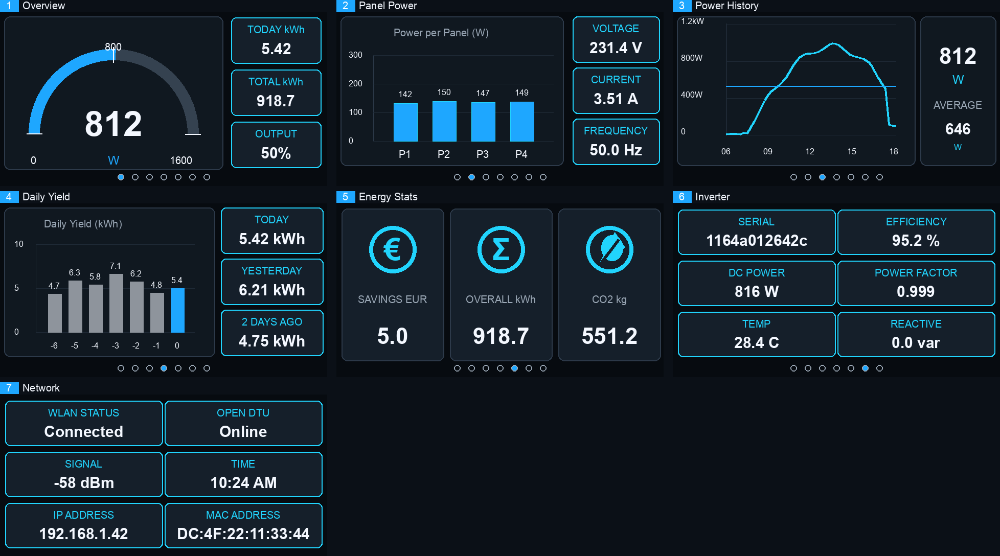

# OpenDTU LilyGo T-Display-S3 Dashboard

This branch adds a modern dashboard experience for OpenDTU on the LilyGo T-Display-S3 / ESP32-S3 display board.

The goal is to provide a compact, readable, dark dashboard for balcony PV systems with one inverter and up to four PV input channels. The display UI is inspired by Grafana-style monitoring dashboards: dark panels, high-contrast values, gauges, charts, persistent themes, and smooth page navigation.

## Hardware Target

- LilyGo T-Display-S3
- ESP32-S3
- ST7789 320 x 170 display
- OpenDTU firmware with TFT_eSPI display support
- One Hoymiles inverter
- Up to four DC panel/string channels

## Inverter Compatibility

This release keeps the original OpenDTU inverter support. In general, every inverter that works with the official OpenDTU firmware should also work with this fork, because the inverter communication, Web API, configuration, and core OpenDTU logic are inherited from the upstream project.

The added LilyGo display dashboard is visually optimized for one inverter and up to four DC panel/string channels. Inverters with fewer channels still work; unused panel positions are shown as empty or zero-value channels on the display dashboard. For the complete and current inverter compatibility list, refer to the official OpenDTU documentation:

- [OpenDTU inverter overview](https://www.opendtu.solar/hardware/inverter_overview/)

## Main Features

- Seven-page dashboard optimized for the 320 x 170 display
- Modern dark UI with rounded dashboard tiles
- 10 selectable color themes
- Theme and last selected page are persisted in LittleFS
- Button navigation between pages
- Second button cycles through color themes
- Smooth horizontal slide animation between pages
- Page dots centered at the bottom of the display
- Animated OpenDTU boot logo
- Waiting screen while inverter data is not available
- Waiting screen can be skipped with the page button
- Automatic timeout after 60 seconds if no inverter data arrives
- Rolling daily yield buffer stored on the ESP
- Power history graph from 06:00 to 18:00
- Average power calculation and average line in the power graph
- Modern web dashboard available at `/modern`
- Link to the modern dashboard in the original OpenDTU navigation bar

## Display Controls

- Lower button: next dashboard page
- Upper button: next color theme
- During the inverter wait screen, the page button skips waiting and opens the dashboard

The selected page and theme are saved and restored after reboot.

## Display Screens

The following simulated screenshots show the current dashboard layout. They are generated from the UI design for documentation purposes and are not camera captures from the physical display.



Individual screen images:

- [Overview](docs/lilygo-t-display-s3/screenshots/01-overview.png)
- [Solar - Power per Panel](docs/lilygo-t-display-s3/screenshots/02-panel-power.png)
- [Power / History](docs/lilygo-t-display-s3/screenshots/03-power-history.png)
- [Daily Yield](docs/lilygo-t-display-s3/screenshots/04-daily-yield.png)
- [Energy / Stats](docs/lilygo-t-display-s3/screenshots/05-energy-stats.png)
- [OpenDTU / Inverter](docs/lilygo-t-display-s3/screenshots/06-inverter.png)
- [Network](docs/lilygo-t-display-s3/screenshots/07-network.png)

### 1. Overview

Shows the most important live values:

- Current AC output power
- 180 degree power gauge
- Today yield in kWh
- Total yield in kWh
- Output percentage based on the configured inverter limit

The gauge uses a 0 W, 800 W, and 1600 W scale and switches the current power unit from W to kW when needed.

### 2. Solar - Power per Panel

Shows DC power distribution for up to four PV channels:

- P1 to P4 bar chart
- Per-panel power values
- AC voltage
- AC current
- AC frequency

The chart scale adapts to the current panel values while keeping the labels readable on the small display.

### 3. Power / History

Shows the current daily production curve:

- Power history graph from 06:00 to 18:00
- Y-axis scaling in W or kW
- Current power value
- Average power value
- Average power reference line

The graph uses an in-memory bucket history and is intended as a compact live trend view, not as a long-term data logger.

### 4. Daily Yield

Shows daily yield information:

- Today, yesterday, and two-days-ago yield tiles
- Seven-day rolling yield bar chart
- Value labels above the bars
- Empty history days are shown as zero

The rolling buffer is stored on the ESP filesystem and aligned by the configured OpenDTU/NTP time.

### 5. Energy / Stats

Shows derived energy statistics:

- Estimated savings
- Overall generated energy
- Estimated CO2 saving

The currency label is selected from the configured timezone: Europe timezones use EUR, other regions use USD.

### 6. OpenDTU / Inverter

Shows inverter and OpenDTU operating values that are provided by OpenDTU:

- Inverter serial number
- DC power
- Temperature
- Efficiency
- Power factor
- Reactive power

Unavailable values are shown as `--`.

### 7. Network

Shows network and status information:

- WLAN status
- WiFi signal strength
- IP address
- OpenDTU status
- Current time
- MAC address field

This page intentionally contains the status information that was removed from the main dashboard pages to keep the live screens clean.

## Boot and Waiting Flow

On startup the display shows an animated OpenDTU logo. After that, a waiting screen is displayed until inverter data is available.

The waiting screen only updates its progress animation to avoid full-screen flicker. If no inverter data is received within one minute, or if the user presses the page button, the dashboard opens anyway.

## Themes

The dashboard includes 10 color themes. Themes affect:

- Gauge accent color
- Tile borders
- Tile highlights
- Header text color
- Value colors
- Icon colors

The background remains dark for readability, while each theme changes the accent and panel color language.

## Modern Web Dashboard

This branch also adds a modern web dashboard at:

```text
http://<opendtu-ip>/modern
```

The original OpenDTU UI remains available. A `Modern` link is added to the original navigation bar so the new page can be opened directly.

The modern dashboard uses a dark, responsive layout with:

- Large current power gauge
- Yield summary
- Panel power chart
- AC metrics
- Inverter status cards
- Modern typography and spacing

## Build and Upload

Build the LilyGo T-Display-S3 firmware with PlatformIO:

```bash
~/.platformio/penv/bin/pio run -e lilygo_t_display_s3
```

Upload to the connected ESP32-S3 board:

```bash
~/.platformio/penv/bin/pio run -e lilygo_t_display_s3 -t upload --upload-port /dev/cu.usbmodem21201
```

If the serial port changes, list available ports first:

```bash
ls /dev/cu.*
```

## Notes and Limitations

- The display UI is currently tailored for one inverter.
- The panel screen is limited to four PV channels.
- The daily yield history starts empty after first flash or filesystem reset.
- Savings and CO2 values are estimates derived from total generated energy.
- The power history graph is held in RAM and starts fresh after reboot.
- The dashboard relies on OpenDTU inverter fields being available; missing values are displayed as `--`.
