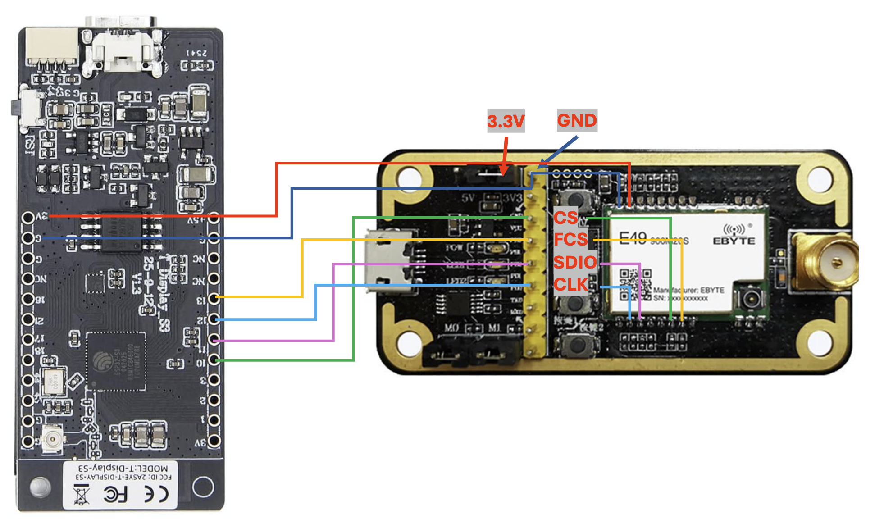

# LilyGo T-Display-S3 CMT2300A Wiring

This wiring is for the LilyGo T-Display-S3 OpenDTU profile:

```json
"cmt": {
  "sdio": 11,
  "clk": 12,
  "cs": 10,
  "fcs": 13,
  "gpio2": -1,
  "gpio3": -1
}
```

## Connections

| LilyGo T-Display-S3 | CMT2300A signal |
| --- | --- |
| 3V3 | 3.3V |
| GND | GND |
| GPIO10 | CS |
| GPIO11 | SDIO |
| GPIO12 | CLK |
| GPIO13 | FCS |



Remove the jumper for SPI operation. Use 3.3 V only.

This diagram is only valid when the shown pads are directly connected to the CMT2300A signals `CS`, `FCS`, `SDIO`, and `CLK`.
